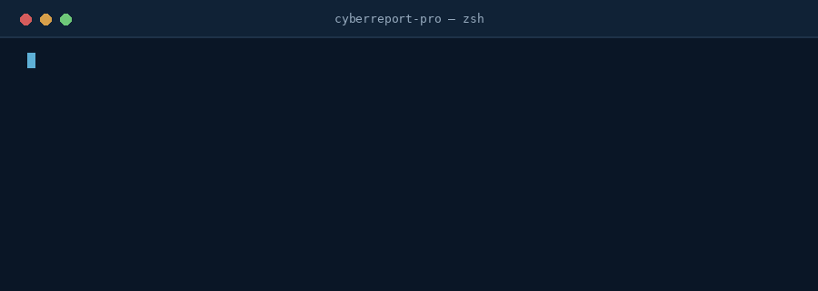
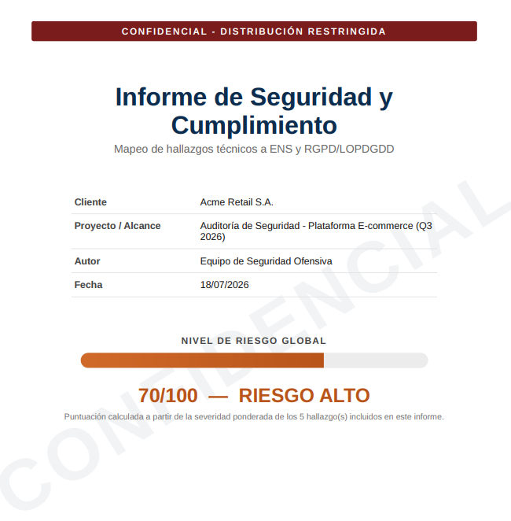
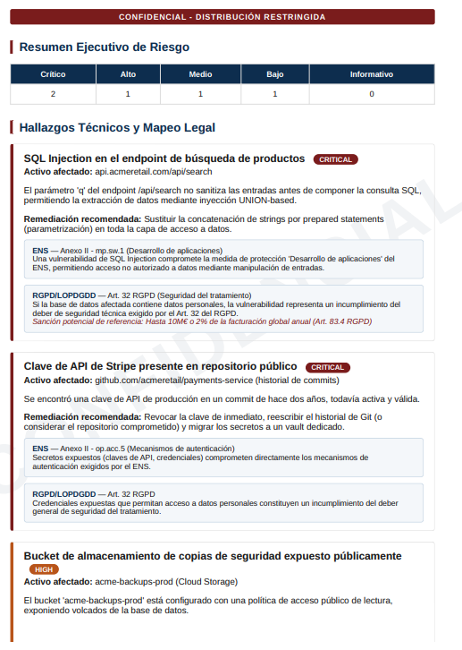
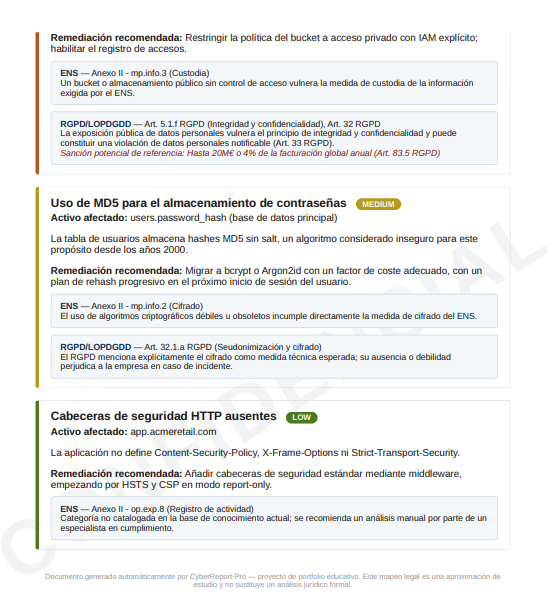

# 🛡️ CyberReport-Pro


Python automation engine that translates technical security findings
(SQLi, exposed storage, weak crypto, leaked secrets...) into executive
PDF reports, automatically mapped to Spain's **Esquema Nacional de
Seguridad (ENS)** and the **RGPD/LOPDGDD**.



> Report content and legal mapping text are generated in **Spanish**
> (the target audience for the compliance frameworks used here), while
> the codebase, docs and CLI are in English (standart).

<p align="center">
  
  
  
</p>

## Why I built this

While studying how security teams operate in Spain, one thing stood out
to me: a large chunk of an analyst's time doesn't go into *finding* the
vulnerability, but into *translating* it — from a technical finding into
something legal and leadership will actually understand and act on.

This project was my way of studying that problem hands-on: build a tool
that automates that translation, and use it as an excuse to properly
learn (not just by name) TDD, CLI packaging, containerization, and
modular architecture in Python.

I'm still learning a lot about the intersection between security and
law, so I treat the legal mapping here as a **study starting point**,
not a definitive legal source (more in Limitations, below).

## What it does

1. **Loads technical findings** from a JSON file (simple format, see `data/sample_findings.json`).
2. **Maps each finding** to the applicable legal frameworks (ENS and/or RGPD), with the specific article and a plain-language risk statement.
3. **Generates an executive PDF** with a cover page, a visual risk gauge (0-100 score), a severity breakdown table, and compliance blocks — ready to send to a client or to leadership.
4. All of this available via an **installable CLI** (`cyberreport-pro generate ...`) or a **Docker image**, with zero local Python setup required.

## Architecture

```
data/findings.json
        │
        ▼
┌───────────────┐      ┌───────────────────┐      ┌──────────────────┐
│  core.loader  │ ───▶ │ compliance_mapper │ ───▶ │  render (Jinja2  │
│ (validates    │      │ (ENS + RGPD)      │      │  + WeasyPrint)   │
│  JSON input)  │      │                   │      │                  │
└───────────────┘      └───────────────────┘      └──────────────────┘
                                                            │
                                                            ▼
                                                       report.pdf
```

I split this into three layers (`core` → mapping → `render`) so each piece
is independently testable. That was the part that taught me the most:
seeing how separating "business rule" (the legal mapping) from
"presentation detail" (the PDF) makes tests much simpler to write.

## Installation

```bash
git clone https://github.com/your-username/cyberreport-pro.git
cd cyberreport-pro
python -m venv .venv && source .venv/bin/activate   # Windows: .venv\Scripts\Activate.ps1
pip install -e .
```

### Or with Docker (recommended — no local Python setup needed)

```bash
docker compose up --build
```

This builds the image and generates the bundled sample report straight to
`./output/report.pdf` on the host. To run any other CLI command against the
same image:

```bash
docker compose run --rm cyberreport-pro list-categories
docker compose run --rm cyberreport-pro generate data/my_findings.json -o output/my_report.pdf
```

> **Windows note:** the PDF engine (WeasyPrint) depends on the Pango/GObject
> native libraries, which aren't preinstalled on Windows the way they are on
> Linux/macOS. If you hit an `OSError: cannot load library 'libgobject-2.0-0'`
> when running the CLI natively, either install the
> [GTK3 runtime for Windows](https://github.com/tschoonj/GTK-for-Windows-Runtime-Environment-Installer/releases)
> (check "Set up PATH" during install), or just use the Docker route above —
> it sidesteps the issue entirely since the container is Linux-based.

## Usage

```bash
# Generate a report from the included example
cyberreport-pro generate data/sample_findings.json -o output/report.pdf

# See which categories already have a legal mapping implemented
cyberreport-pro list-categories
```

Expected input format (abridged — full example in `data/sample_findings.json`):

```json
{
  "client_name": "Acme Retail S.A.",
  "project_name": "Q3 2026 Security Audit",
  "author": "Your Name",
  "findings": [
    {
      "id": "F-001",
      "title": "SQL Injection in the search endpoint",
      "description": "...",
      "severity": "critical",
      "category": "sql_injection",
      "affected_asset": "api.example.com/search",
      "remediation": "Use prepared statements."
    }
  ]
}
```

## Tech stack

| Layer | Tool | Why |
|---|---|---|
| CLI | `click` | Nicer API than `argparse` for commands with subcommands |
| Templates | `jinja2` | Keeps report layout separate from Python logic |
| PDF | `weasyprint` | Renders modern CSS properly (gradients, `border-radius`, repeating watermarks via `position: fixed`, page counters). Switched from an earlier `xhtml2pdf` prototype once its CSS 2.1-era limits started capping report quality — see [CHANGELOG](CHANGELOG.md) |
| Tests | `pytest` + `pytest-cov` | 24-test suite, 95% coverage |
| Quality | `ruff`, `mypy`, `bandit` | Linting, static typing, and security analysis |
| Automation | GitHub Actions | Runs lint + type check + security scan + tests on 3.10/3.11/3.12 on every push |
| Packaging | Docker + docker-compose | Runs the CLI with zero local Python setup, sidesteps native-dependency issues across OSes |

## Running it locally

```bash
make dev     # install with dev dependencies + pre-commit hooks
make check   # lint + typecheck + security scan + tests, same as CI
make demo    # generates the sample report to output/report.pdf
```

Or step by step:

```bash
pip install -e ".[dev]"
pytest              # runs the suite with coverage
ruff check .        # lint
mypy src/           # static type checking
bandit -r src/      # security scan on the tool's own code
```

I found it fun to run Bandit against a security tool — a bit ironic, but
a good reminder that "whoever handles security" also needs to apply the
same process to themselves. There's also a [SECURITY.md](SECURITY.md) with
a disclosure policy, for the same reason.

## Limitations (stated openly)

- The legal mapping currently covers 4 technical categories (SQLi, public
  storage, weak crypto, exposed secrets). Categories outside these fall
  back to a generic mapping — that's a clear expansion roadmap, not a
  hidden gap.
- The legal content was built by reading RD 311/2022 (ENS) and the
  RGPD/LOPDGDD for study purposes. **It does not replace review by a
  legal team or DPO** before any real use with a client.
- There is no direct integration with scanners (SAST/DAST) yet — input
  is manual via JSON. That's the natural next step, connecting with
  other projects in my portfolio (`sql-defender`, `ai-dlp-scanner`).

## Next steps

- [ ] Add more categories to `compliance_mapper` (XXE, SSRF, IDOR).
- [ ] Support ISO 27001 as a third compliance framework.
- [ ] Feed `sql-defender`'s output directly as a findings source.
- [ ] REST API (FastAPI) over the same core, for programmatic report generation.
- [ ] Alternative export in Markdown/HTML, in addition to PDF.

See [CHANGELOG.md](CHANGELOG.md) for what's already shipped.

## Contributing

Issues and PRs welcome — see [CONTRIBUTING.md](CONTRIBUTING.md).

## License

MIT — see [LICENSE](LICENSE).
